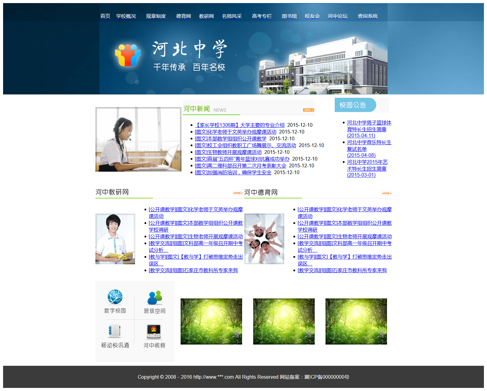
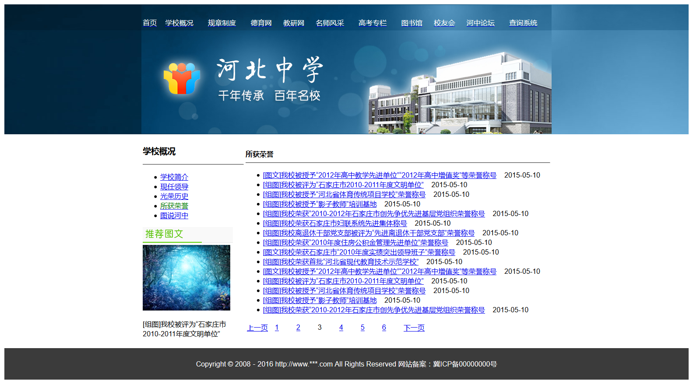
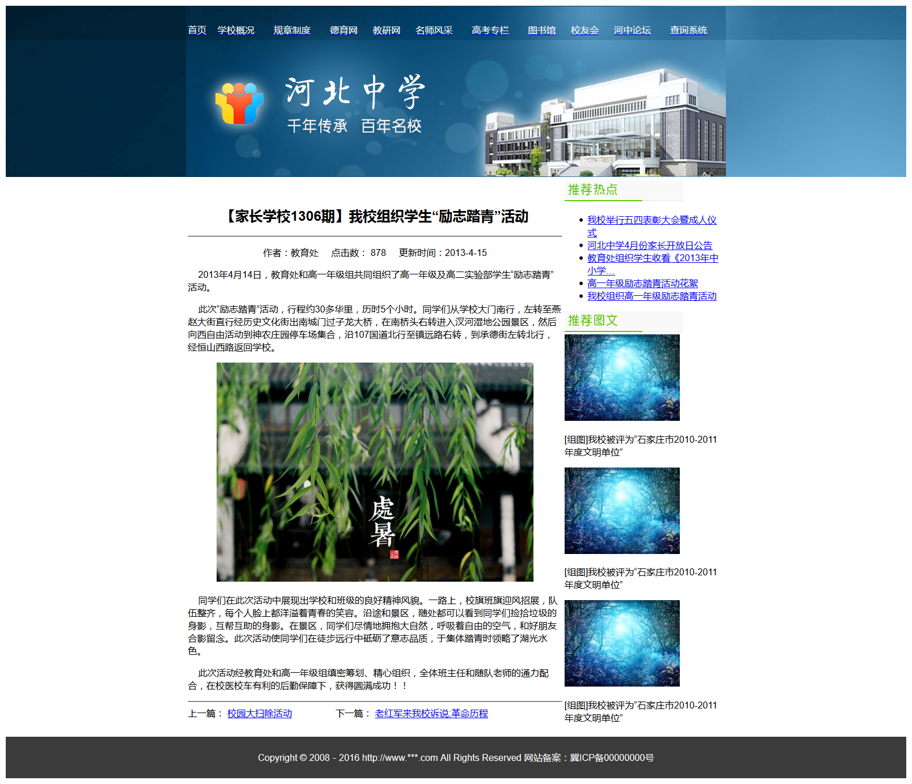
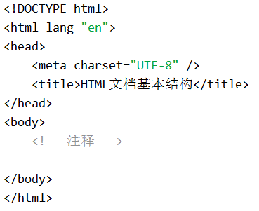
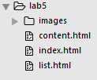
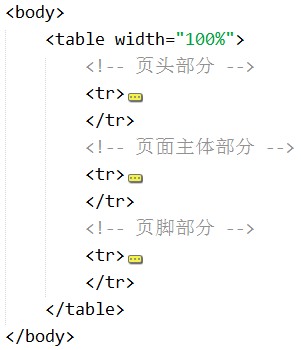
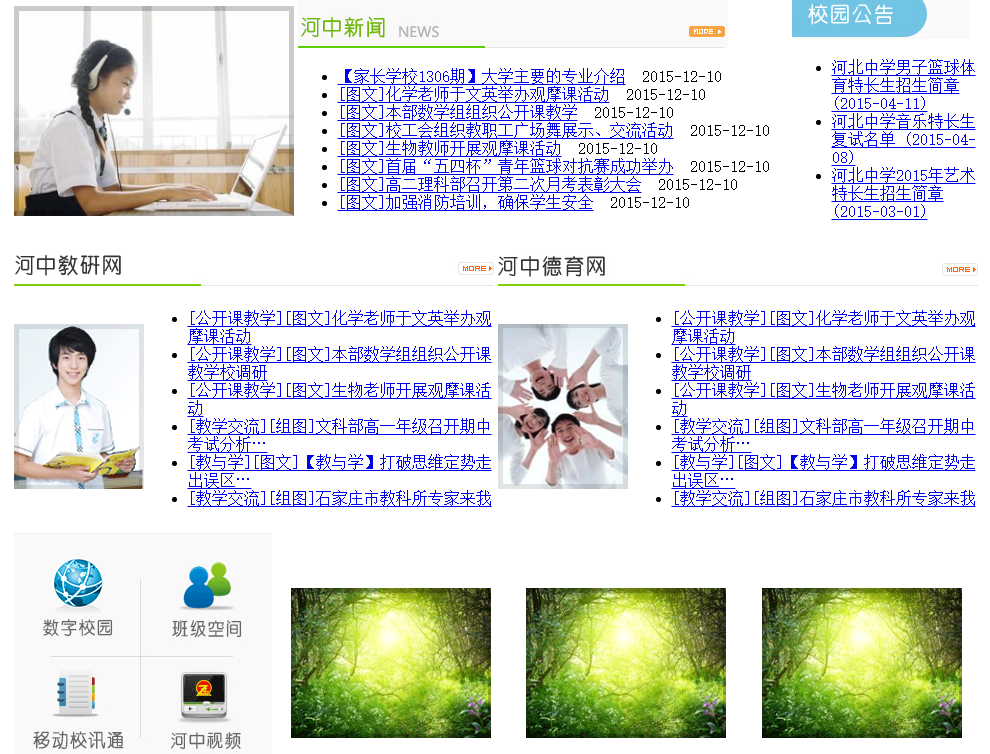
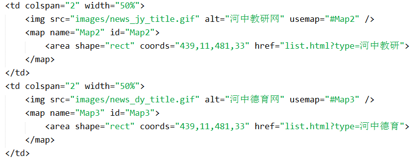

#
实验六 HTML建立网站实战

##一、	实验背景
 本实验通过完整的网站实例（河北中学），要求同学们熟练掌握HTML制作静态网站的基本使用方法，同时理解借助HTML表格标签`<table>`实现网页结构布局的基本思想。
 
##二、	实验目标
本实验讨论在网页开发过程中，常用到的网页元素：表格、标题、段落、列表、图片、超链接、表单元素、水平线等，通过本实验的学习，掌握在何时使用何种元素，以及使用各种元素过程中应该注意的问题。  

为把相应元素放到网页的恰当位置，本实验使用表格进行网页布局。所谓布局，即将不同的内容放置在table的不同td里，达到网页内容可以整齐地显示在网页的某个具体位置上，可以是页面顶部，页面中间，页面左侧，页面右侧等等。  

本实验静态网站至少包含3类页面（网站首页、新闻列表页、新闻内容页），实验要达到的效果图如下图所示。
  

  

图6-1 河北中学首页效果图
  

  

图6-2 河北中学新闻列表页效果图
     

  

图6-3 河北中学新闻内容页效果图
 

##三、	实验目的 
+ 熟练掌握使用HTML建立静态网站的基本方法。
+ 熟练掌握常用HTML结构性标签及其属性的使用方法。
+ 理解网页布局的基本思想，理解结合<table>标签实现网页布局的设计思想。
 
##四、	理论基础 
###4.1	网页结构  
任何一个网页，从整体上一般可以分为顶部、中部和底部三部分，如下图6-4所示。而对于同一网站而言，不同页面的网页顶部和网页底部内容一般是相同的，这样我们就可以重复使用这些相同部分。  

  

  
  
图6-4 网页结构
  
网页顶部中一般包含有网页的特征性元素（即能直接与其它网站相区分的元素），比如网站Logo、网站Banner、网站导航栏等；有时候在网页顶部也常常加入用户注册/登录链接、站内搜索栏等其它辅助栏目。  
网页中部为网页正文区域，是用户最关心的一块区域，该区域包含网页需要显示的绝大部分内容；该区域一般可选元素有：网页栏目版块、新闻版块、文章内容版块、用户登录版块、快速导航版块、广告版块等等（该部分内容十分丰富，各网站差异极大，在此不再一一列举各个元素）。  
网页底部区域一般包含网页的版权信息、审批信息、声明信息、友情链接等辅助性信息；该区域相对比较简单，大多数主流网站在此区域中的结构形式大致相同。   
  
###4.2	网页布局  
任何一个网页中包含了大量的网页元素，那么这些元素是如何组织在一起的呢（即这些网页元素的排列顺序是什么样的？这些网页元素的位置是怎么样的？）？  

此时涉及到网页布局的相关问题。网页布局是指网页内容在网页上所处位置的设计。其实在上文我们谈到网页一般分为顶部、中部、底部三块区域及各自区域中的网页内容，就是一种最简单的布局方式（即决定了特定网页内容在网页中所处的位置）。网页布局是一种非常具有创意性的工作，对于初学者来说，应该多多借鉴主流网站的经典布局方式，来制作自己的网站（虽然你可以按照你所喜欢的任意形式布局网页，但是一种约定俗成的标准或者说大多数访问者的浏览习惯，会帮助你大大提升网页的友好性和可接收性；毕竟你的网页不仅仅是你一个人看的）。 
 
网页布局的基本流程：具体实现方法以上机实践为例进行讲解。  

1)	手绘网页整体布局结构（顶部、中部和底部）。  
2)	分析顶部、中部和底部各自的布局结构，进行内部拆分，并手绘结构图。  
3)	使用HTML实现网页结构。  
4)	调整网页源代码，优化网页代码（去除不必要的嵌套）   
  
###4.3  HTML标签小结  
HTML（Hyper Text Markup Language）：超文本标记语言，仅是用于描述网页文档结构内容的一种标记语言，而不属于编程语言范畴。HTML的主要作用就是，以结构化的标签（或标记）来告诉Web浏览器在特定位置显示特定网页内容。学习HTML，本质就在于学习HTML常用标签及其属性（对标签附加特性的补充说明）的使用方法。  
1)	HTML基本结构类标签
  
  

  
2)	HTML文字段落类标签：`
`、` `、`<h1>` ~ `<h6>`、`<ul>`、`<ol>`、`<li>`  
3)	HTML图像类标签：``、`<map>`、`<area/>`、`<canvas>`   
4)	HTML链接类标签：`<a>`、`<link/>`  
5)	HTML表单类标签：`<form>`、`<input/>`、`<select>`、`<option>`、`<textarea>`、`<label>`    
6)	HTML表格类标签：`<table>`、`<tr>`、`<td>`、`<th>`  
7)	HTML音频/视频类标签：`<audio>`、`<video>`  
8)	HTML框架类标签：`<frame>`、`<frameset>`、`<iframe>`    
9)	HTML样式相关标签：`<strong>`、`<em>`、`<big>`、`<small>`、``、``、``  
 
##五、	实验步骤   
###5.1  步骤一： 建立网站目录结构
在lab5目录下，建立images文件夹（包含网站中所使用的图片）,同时建立3个html文件（index.html、list.html、content.html），如下图6-5所示。  

  

  
  
图6-5 网站目录结构
  
###5.2  步骤二： 首页添加网页布局结构
由于“河北中学”网站中这三类页面具有相同的网页顶部、网页中部和网页底部结构，首先从整体上把网页划分成上、中、下三部分。在index.html文件中，建立该三部分的结构性代码（借助表格标签的三行来实现），示例代码如下所示。  
  
  

  
###5.3  步骤三：设置网页顶部代码 
页头部分主要有背景图片和导航栏组成，这些网页元素应该位于表格中进行布局排列。导航栏的构成比较简单，直接使用`<a>`标签即可（注意：超链接的地址统一设置为content.html）；背景图片的设置比较复杂，因为该背景图效果是由images文件夹中的bg.gif和banner.jpg两个图片文件组成的。  
补充网页顶部需要注意的一些样式信息：超链接的字体颜色是white，可以借助``标签实现；bg.gif图片铺满整个屏幕（100%），banner.jpg图片占据整个屏幕的60%且居中显示；导航栏部分高度大概是75px。  
###5.4  步骤四：设置网页底部代码
网页底部代码比较简单，只需要注意两点样式信息：文字颜色为white；网页底部使用背景图片foot_bg.gif填充。  
###5.5  步骤五：设置index.html网页中部内容
1)	首先index.html页面网页中部从上到下又可以划分为3部分，所以可以再次借助表格的3行来实现结构，如下图6-6所示。  

  

  
  
图6-6 index.html页面中部结构
  
2)	现在开始分析上部代码结构。按照布局的基本思想，又可以把其分为左、中、右三部分组成，而这三部分可以由1行3列的表格支撑。该部分网页元素主要有超链接、图片、列表等组成，需要注意的问题主要有以下几个：第一，左、中、右三部分的宽度比较分别是25%、55%和20%；新闻列表中所有超链接的链接地址均指向content.html页面；“河中新闻”图片右上角的“more”使用图像热区实现，其中热区核心代码如下所示。   

  

3)	接下来分析中部分代码结构。该部分代码比较复杂，首先通过效果图对该部分进行划分，如下图6-7所示。  

  

  
  
图6-7 index.html中部之中部结构

通过图5-7可以发现该部分网页整体是由一个2行4列的表格组成的，其中第一行的两个单元格要分别跨列显示（colspan）；另外，“河中教研网”和“河中德育网”分别使用了图像热区，其热区坐标如下所示。  
  
  

4)	最后处理最下方部分，该部分结构比较简单，直接由1行4列的表格组成，其中注意最左侧大图片是由4个热区组成，其坐标示例代码如下所示。  
  

###5.6   步骤六：设置list.html网页中部内容
list.html页面整体结构由1行2列的表格组成，其中左侧占据25%宽度，右侧占据75%宽度。
此页面内容比较简单，强调两个注意问题，其它问题不再赘述。第一，“学校概况”和“所获荣誉”下方通过水平分割线与其它元素分割；第二，分页码部分由1行8列的表格组成。
###5.7   步骤六：设置content.html网页中部内容
content.html页面结构基本和list.html页面结构相似，不再详细展开讨论。注意：左侧内容区域占据70%宽度，右侧列表区域占据30%宽度；另外，“上一篇”和“下一篇”新闻部分可以直接使用空格（&nbsp;）分开，不需要再划分表格结构。

##六、	实验作业（完成并提交）
使用Sublime Text 3完成本实验的网页文件，把作业上传到ftp服务器，并把ftp地址提交到雪梨教育同步课程相应任务下。
##七、	推荐阅读
http://www.111cn.net/cssdiv/css/57963.htm  
http://wenku.baidu.com/link?url=UL-hi2_mGChJa1-C_afK02MXY0plHySYtbDKx29CkgjMuseX0CRavmMAkJ0YspuCuS__SlWynW8PeY2O2Gu-Znf1FUEFhQE91Rjyqlfz5sy

